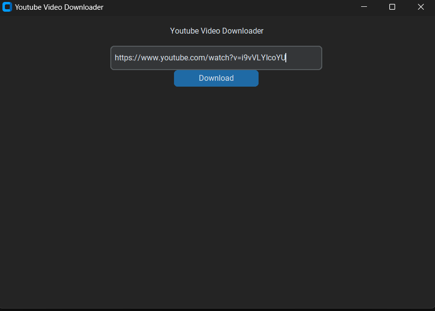
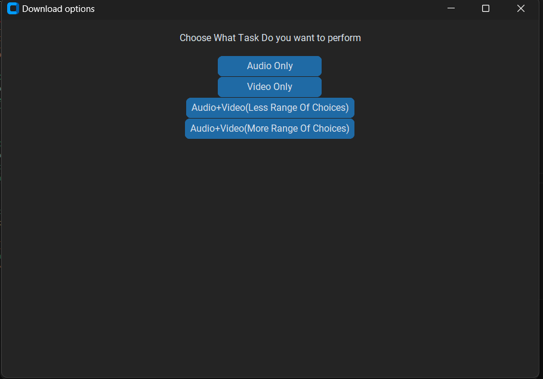
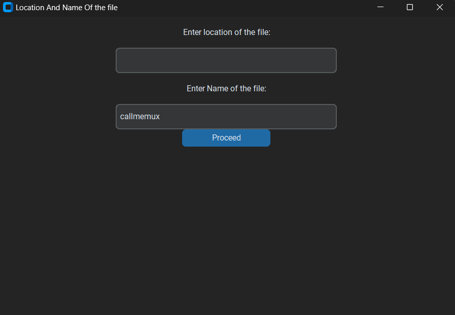
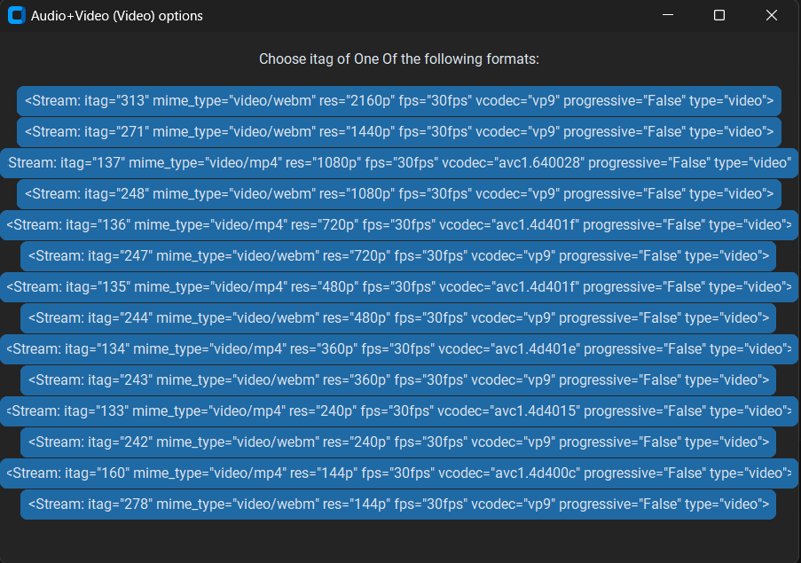
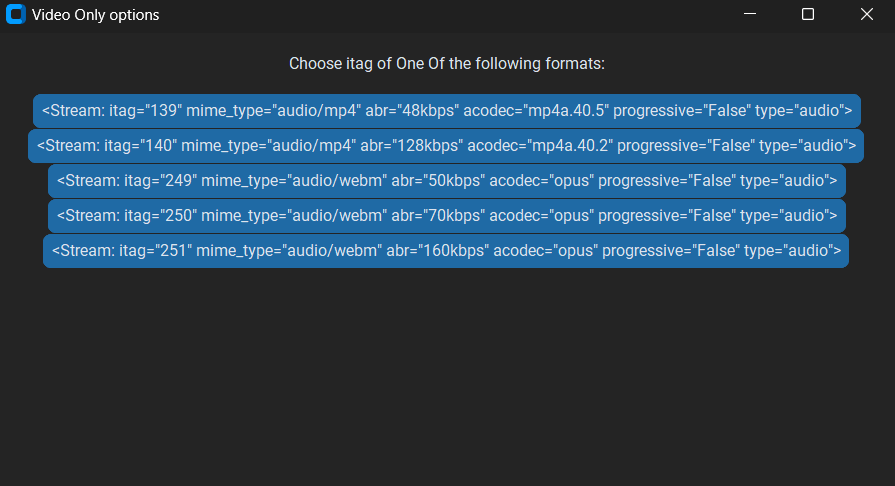
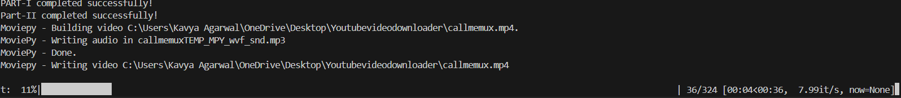
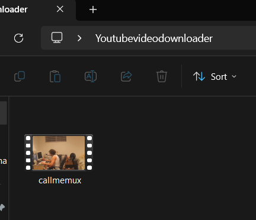
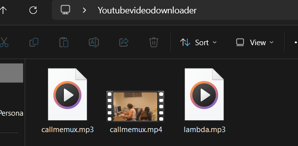
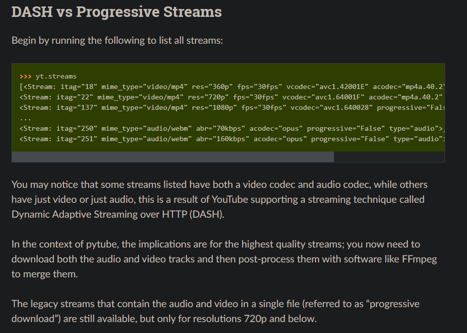

# **Youtube Video Downloader**

*This is a program written in Python with GUI , which is meant to download Youtube Videos in the FASTEST , Easiest And Most Convinient Way Possible*

---
## Details:

 **External Python Libraries used**

 - [Custom Tkinter](https://github.com/TomSchimansky/CustomTkinter)
 - [Pytube](https://pytube.io/en/latest/)
 - [Moviepy](https://zulko.github.io/moviepy/)

 ---
## Snapshots And How To Use(Problem Statement mentioned after that)
- ### CASE-I(Audio+Video(With More Range Of Choices))**
---
* #### Step-I(Home Page)
  
* ### Step-II(Choice Of File Type To Download)
  
* **Step-III(Interface Differs for other options and this i.e both have different sequence of how input is taken) - Taking input of location and filename(Without file format (.mp3,.mp4 etc.) is preferred)-ENTER FILENAME AND LOCATION , THEN CLICK ON PROCEED**
  
* ### Step-IV (Choosing The Video File Format)
  
* ### Step-V (Choosing the Audio File Format)
  
* ### While Downloading , This Is what will appear on terminal (**Only For  Audio+Video(With More Range Of Choices)**)
  
* ### This indicates the program has finished running 
  
* ### Enjoy Your Youtube Video !!!
  
---
  - ### CASE-II(All Other Cases)**
---
* #### Step-I(Home Page)
  
* ### Step-II(Choice Of File Type To Download)
  
* ### Step-III (Choosing the Audio File Type)(Suppose)
  
* ### Step-IV (Choosing the Audio File Format)
   
* ### Step-V (This will be visible once your file downloads)
   
* ### Enjoy Your File !!!
   

  ## What EXTRA Does the Program Do?
>I began writing this as a basic program for downloading youtube videos but as i went through the documentation of Pytube , I found something interesting 
 [Kindly Refer to this article before reading further about this topic](https://pytube.io/en/latest/user/streams.html#filtering-streams)

>It can be seen that the pytube library has a drawback . It is good for downloading audio,video separately and progressive file streams(Audio+Video) which are less than equal to 720p in format , so what if someone wants to go beyond ? What if someone wants to download in the maximum Video and Audio Quality Possible . This is where my program comes , instead of you downloading audio and video streams seaprately and integrating them using a separate software like FFmpeg , you can directly download the file after specifying the file location and name . (In short - IT SAVES YOUR TIME!!!)

---
>You can refer the source code [here](https://github.com/Kavya879/YoutubeVideoDownloader/blob/main/Youtubevideodownloadercode.py) -Explaination has been provided where i think it might be difficult for you to understand
---
  ## HOPE YOU LIKE THE WORK!!!

---

## Authors

[@Kavya1405](https://github.com/Kavya879)

